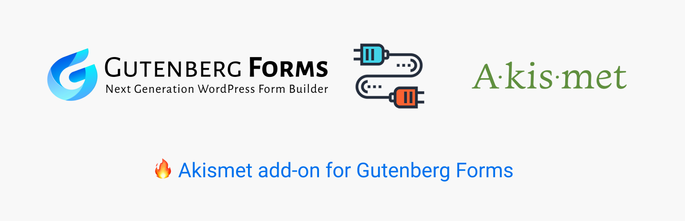
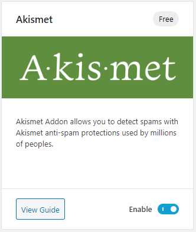
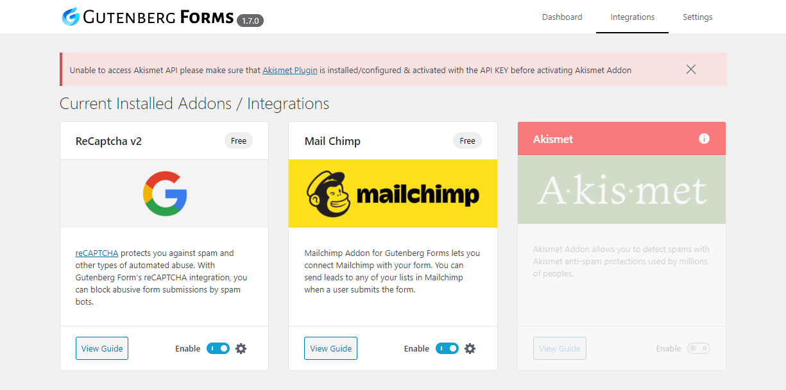
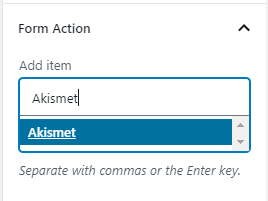
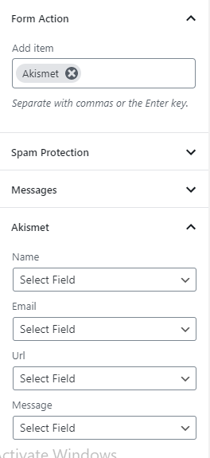
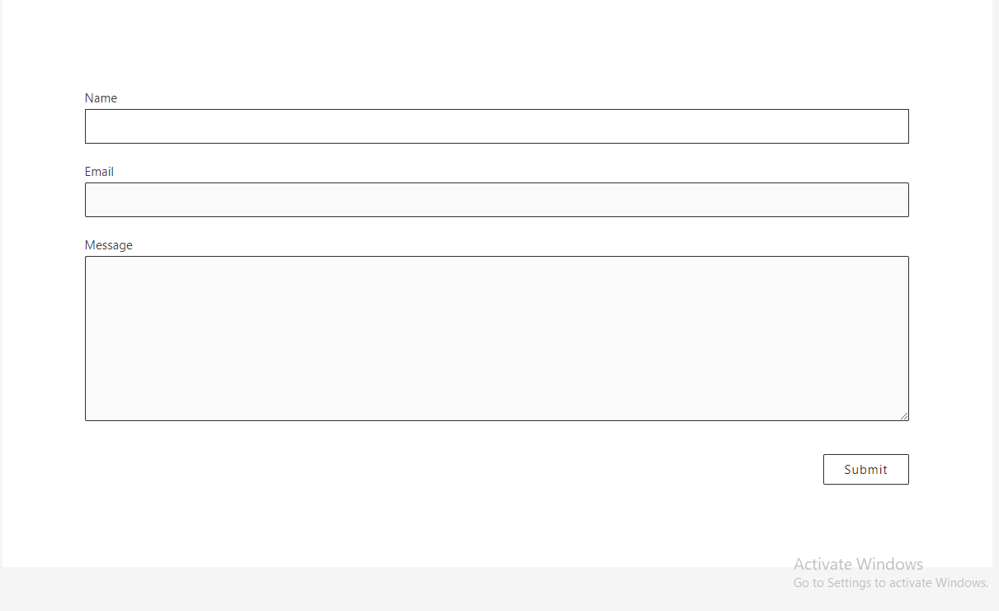

# Akismet

## How to create a Gutenberg Form with Akismet Anti Spam Protection

Here are some quick steps of this tutorial that we need to follow in order to create a protected form:

* Install the required plugins
* Configure the required plugins

### Install the Required Plugins

In order to create a spam-protected form with [Akismet](https://wordpress.org/plugins/akismet/) protection. You must have the following plugins:

* \*\*\*\*[**Akismet**](https://wordpress.org/plugins/akismet/)  - This is the core Akismet plugin
* \*\*\*\*[**Gutenberg Forms Akismet Addon**](https://wordpress.org/plugins/guten-forms-akismet/) - Gutenberg forms addons that let you connect and create Gutenberg forms with Akismet Protection.
* \*\*\*\*[**Gutenberg Forms**](https://wordpress.org/plugins/forms-gutenberg/) - Of-Course you need this installed as well. 😊


You can also install and activate the **Gutenberg Forms Akismet Addon** from the **Gutenberg Forms Dashboard -&gt; Integrations**


### Configure the Required Plugins

After installing the required plugins that are mention above. Let's configure them step by step.

#### Akismet

Akismet has a very good [API](https://docs.akismet.com/) that you can follow in order to configure it according to your requirements.

**Gutenberg Forms Akismet Addon**

Now we are heading up to the main part of this tutorial. 

If you have followed all the steps above right then you are just a few steps away from having a working Gutenberg form with the **Akismet addon.** 

Here are a few steps to configure the Akismet addon correctly**.**

The first step for any Gutenberg Forms addon is to enable the addon. Before proceeding to further steps make sure the addon you want to configure is enabled.


If you haven't configured the Akismet plugin with a valid API KEY. You may see this error prompting you to configure it correctly before activating the Akismet addon.


### Create an Akismet Protectd Form

Now your add-on is ready to use inside the Gutenberg Form. Let's create a new Gutenberg form inside the block editor.

You can now see a new suggestion in the "form actions".

After selecting Akismet in the "form actions". You can now see a new panel named as **Akismet.** Here you can map the fields which need protection.

After selecting the fields you can now publish the form. That's how easy it is to create **Gutenberg Form** with **Akismet Protection**.

Here is the final form. Of course, you don't see much in this image below. But it does protect you from a lot of spams.

