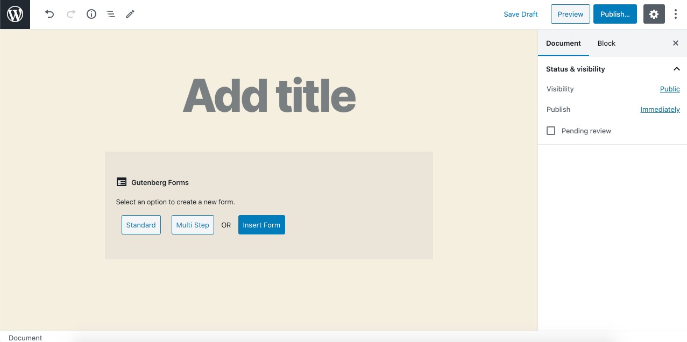
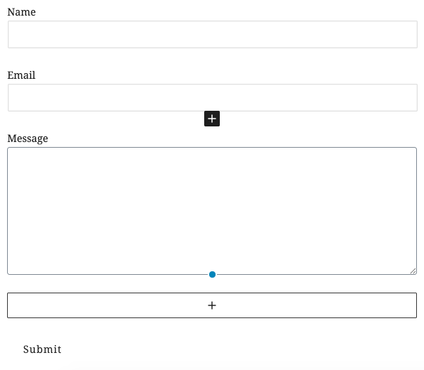
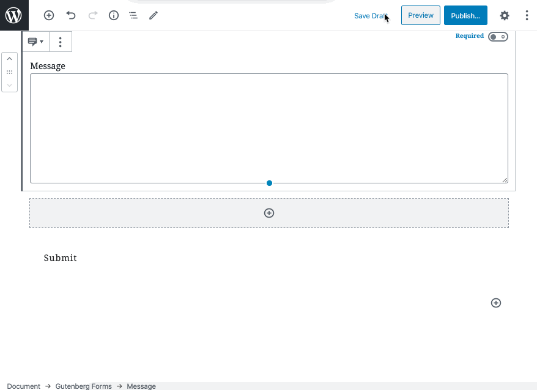
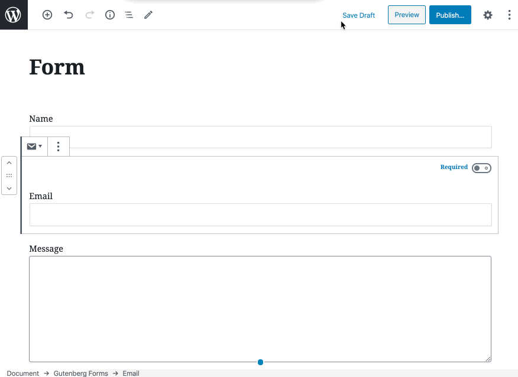
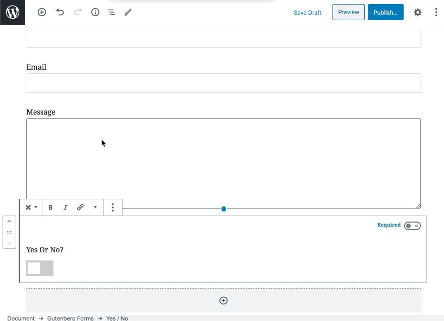

# Standard Form

## How to Create a Standard Form

Add **Gutenberg Forms** Block in the WordPress editor and click the "Standard" button.

Once clicked you will see a simple form with few fields added by default. 

You may remove the fields you don't need and add your desired fields. All fields are actually Gutenberg Blocks, so you can add them as similar you add any Gutenberg Block.

### How to add & arrange form fields

As mentioned earlier, it is all exactly similar to how you add any Gutenberg Block. So here are possible ways to add a form field block.

#### Add a field at the end

Click on the block inserter button within the Gutenberg Forms Block which displays at the end.

That shows you a popup with all the available blocks. You can see all the Gutenberg Form Blocks which you can insert by clicking on anyone you need.

#### Add a field in between other fields.

Simply click on the \[+\] icon appears below when you mouse hover any field/block in Gutenberg editor. And insert a field/block there.

#### Rearrange or Move fields up & down

Gutenberg Editor makes it super easy for you to arrange your blocks, and so is the Gutenberg Form builder. Simply click on the mover icons on the left of each field block to move a field up or down. Alternatively, you may also hold and drag the field block.

That's how easy it is. This way you can create any type of form easily. 


You can also add other Gutenberg blocks inside your form block between your fields. This way you can create more visually appealing forms.


