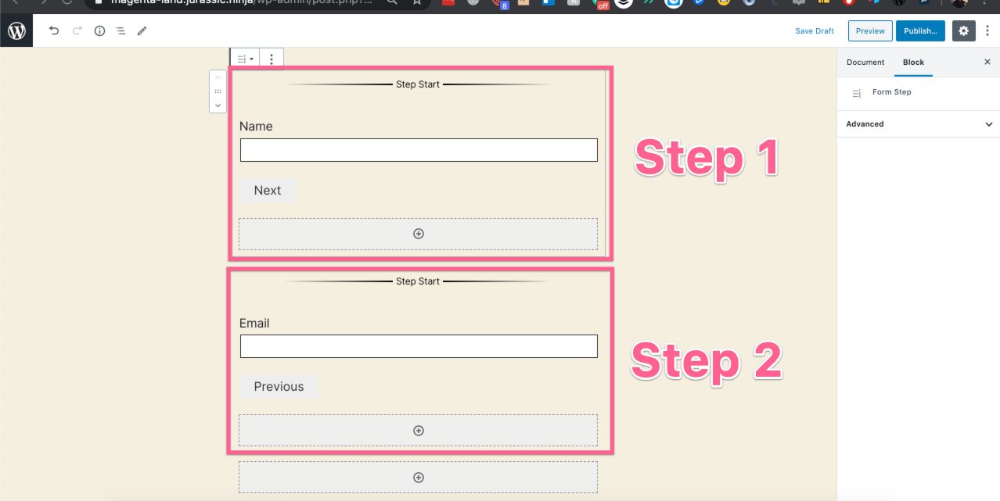
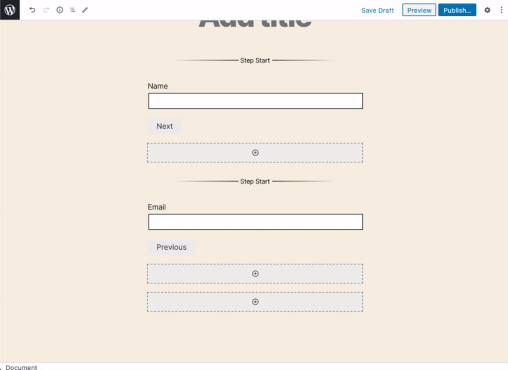
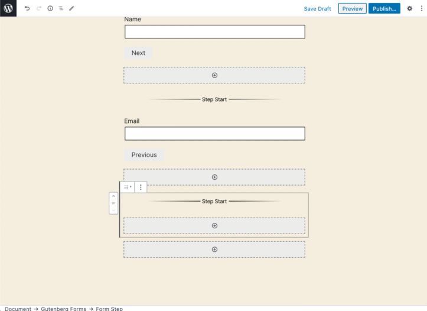
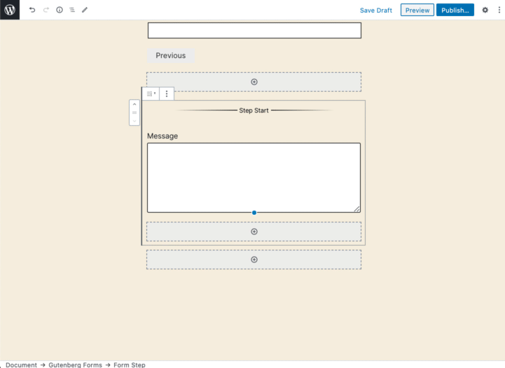

# Multi-Step Form

## How to Create a Multi-Step Form

Add **Gutenberg Forms** Block in the WordPress editor and click the "Multi-Step" button.

Once clicked you will see a simple multi-step form with few fields and two steps added by default.

As you can see a sample short form has been added to help you get started creating your multi-step form easily. Now you need to be careful while creating a multi-step form that you do not add any field/block outside the "**Form Step**" block. This is why we are giving you a head start with 2 steps blocks already added. 

### Add & Arrange Fields

This exactly similar to how it has been explained in the "[Standard Form](how-to-create-a-standard-form.md)" creation instructions. You just need to make sure you are adding your fields inside the desired "**form step"** block.

### Add & Arrange Form Steps

When you are creating a multi-step form, you will get a new block called "Form Steps". This is a wrapper block to create your form pages and add fields inside it. To add a new step simply click on the block inserter at the end and select the "**Form Step**" block.

Now you get a new step. You can now add form fields inside this step.

Now for the new step, you also have to add desired buttons. 

For example, if this is the last step you have to add at least two buttons.

1. **Previous** - To let the user go back to the previous step.
2. **Submit** - To let the user send submit the form.

If this is one of the middle steps, you still need to add two buttons.

1. **Previous** - To let the user go back to the previous step.
2. **Next** - To let the user go to the next step.

If this is the first step you simply need to add one button.

1. **Next** - To let the user go to the next step.


You can place these buttons anywhere as you like. You may also use the "Form Column" block to make them sit in a row.


#### Button Actions

The "Form Button" block has different actions that you can set for the purpose you are adding the button.

There are currently four actions available.

1. **Reset** - To let the users reset a filled form.
2. **Submit** - To let the users submit the form.
3. **Next** - To let the users proceed to the next step.
4. **Previous** - To let the users go back to the previous step. 

So you simply need to add Form Button for each step and apply the required action to it. 

This is how you can create a fully flexible multi-step form using Gutenberg Forms plugin.


You need to be careful while adding your fields. Make sure you do not add a field outside the step block. Also, make sure you have desired buttons added with appropriate actions applied in each step.


