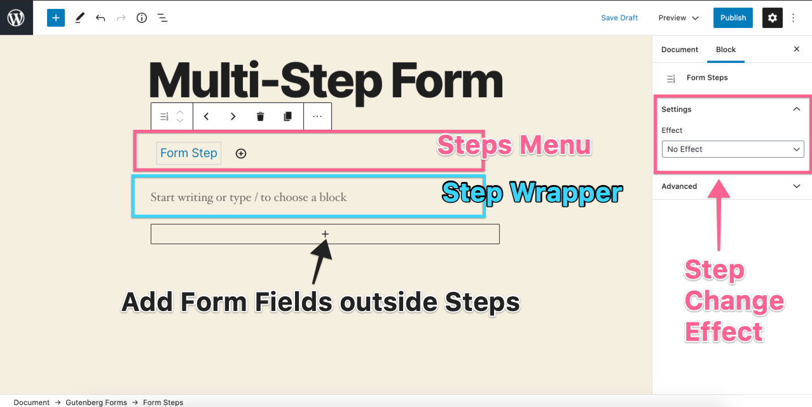
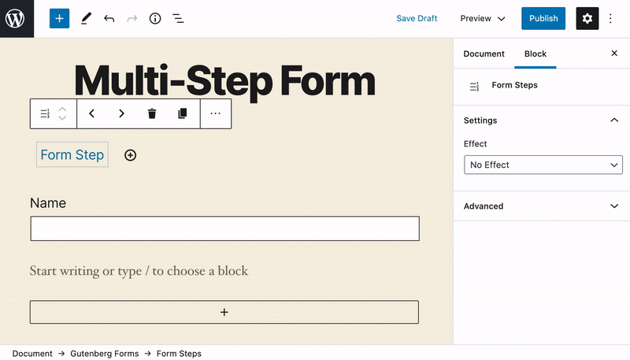
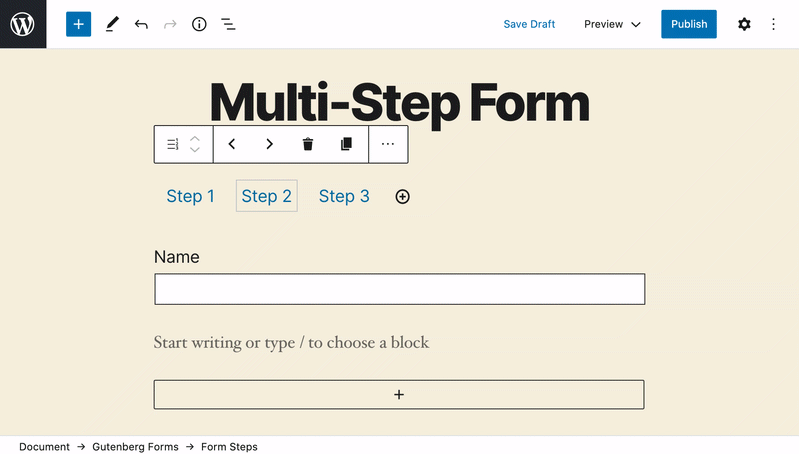
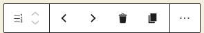
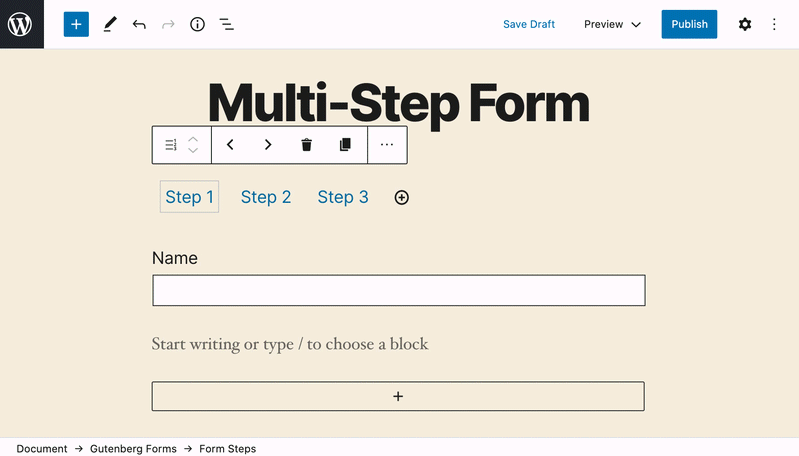
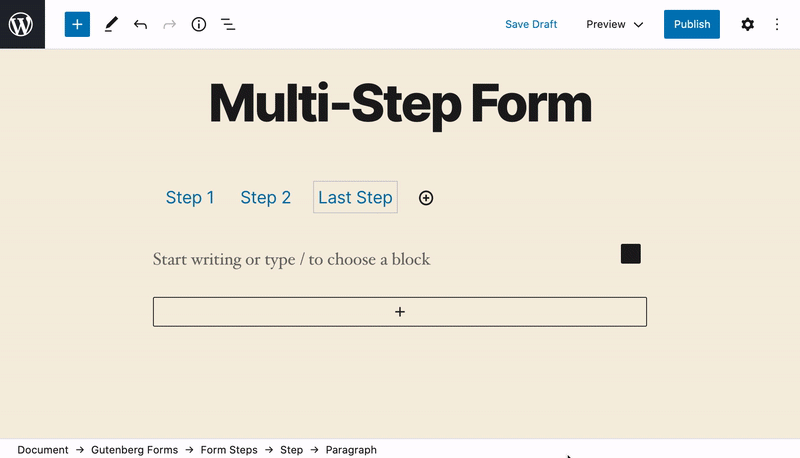
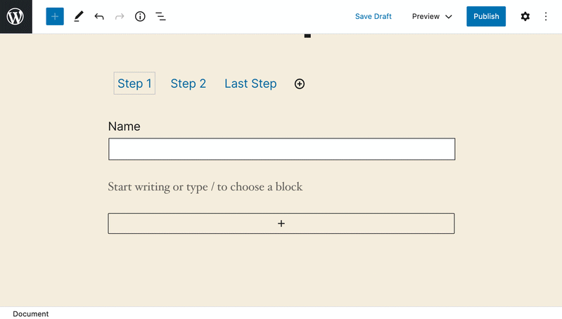
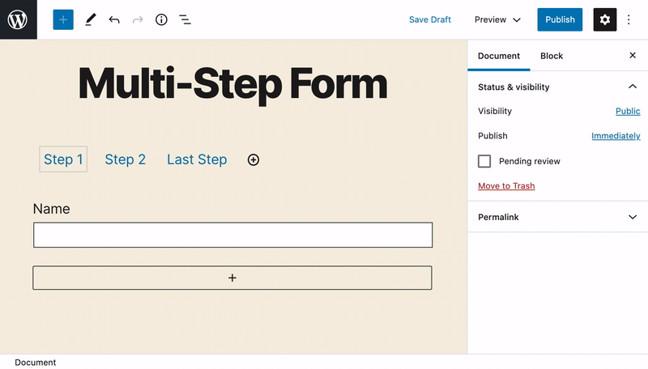

# Multi-Step Form

## How to Create a Multi-Step Form

Add **Gutenberg Forms** Block in the WordPress editor and click the "Multi-Step" button.

Once clicked a simple multi-step form with an empty step will be added by default.

This is the "**Form Steps"** block that you see in the screenshot above. This block is added by default when you choose to create a Multi-Step form. The block interface is very easy to work with. 

### Add Form Steps

Inside Steps block, you get a steps menu where you can create new steps by clicking on the \[+\] icon at the end. You may also click and change form step labels just for easier recognition of what this step is for.

You may also change the step label to something more recognizable. 

### Arrange, Delete & Duplicate Form Steps

It's super simple from the block toolbar on the top. 

The toolbar has four controls/icons that let you do the following:

* **Re-Arrange Steps** - Using the left & right icons. 
* **Delete a Step** - Using the bucket icon.
* **Duplicate a Step** - Using the icon next to the bucket. 

You can now add form fields inside this step.

### Add & Arrange Fields

This exactly similar to how it has been explained in the "[Standard Form](how-to-create-a-standard-form.md)" creation instructions. 

### Add Next, Previous & Submit Buttons

Once you have created all the steps and filled them with desired fields, you also have to add form buttons. 

Form buttons can be added inside each step, but we recommend to simply add them outside your **Form Steps** Block. 

To do that, simply click on the bottom block inserter button and add the "**Form Button**" block. This form button block allows you to assign different actions \(next, previous, reset & submit\). So you simply need to add it at-least three times for Next, Previous & Submit.


You can make use of Form Column block to arrange them in a row and can also move them on top of the Form Steps Block.


### Form Button Actions

The "Form Button" block has different actions that you can set for the purpose you are adding the button.

There are currently four actions available.

1. **Reset** - To let the users reset a filled form.
2. **Submit** - To let the users submit the form.
3. **Next** - To let the users proceed to the next step.
4. **Previous** - To let the users go back to the previous step. 

So you simply need to add Form Button and apply the required action to it. 

### Add Progress Bar \(Optional\)

There is also a progress bar block that you can use in your multi-step forms to show the progress to the user while they are filling out your form.

You can add it using the bottom block inserter. It is fully customizable and can be moved on top of the Steps block as well. So you are free to add and place it anywhere as you like.  

_**This is how you can create a fully flexible multi-step form using Gutenberg Forms plugin.**_

