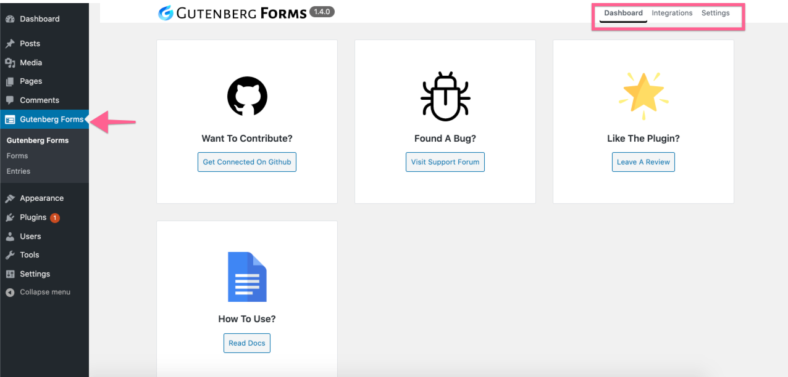
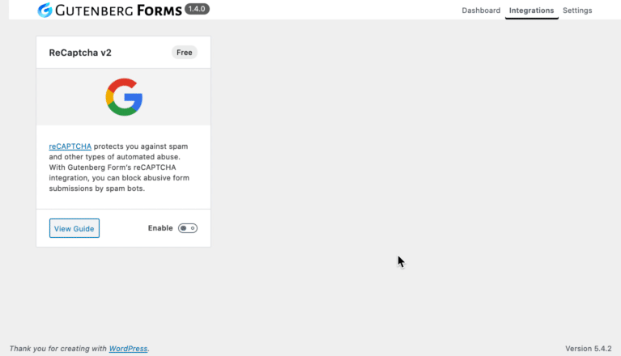

# Explore Admin Area

Once activated you will see a new menu item in your WordPress dashboard "**Gutenberg Forms**". This includes the admin settings page, Forms page & Entries page. Let's explore further about these pages.

### **Admin Dashboard**

The main dashboard page contains different useful information and has a menu on top for additional settings & integrations.

### **Integrations**

Here you will find available Integrations and Add-ons for Gutenberg Form. You can enable those that you want to use. once enabled you may also notice a little gear icon that will take you to the settings for this integration. Make sure you configure the settings properly for the integration/add-on you like to use.

### **Settings**

This is where you will find different settings for the Form and integrations/Add-ons.

