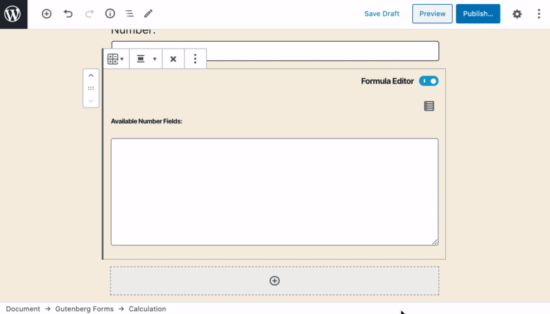
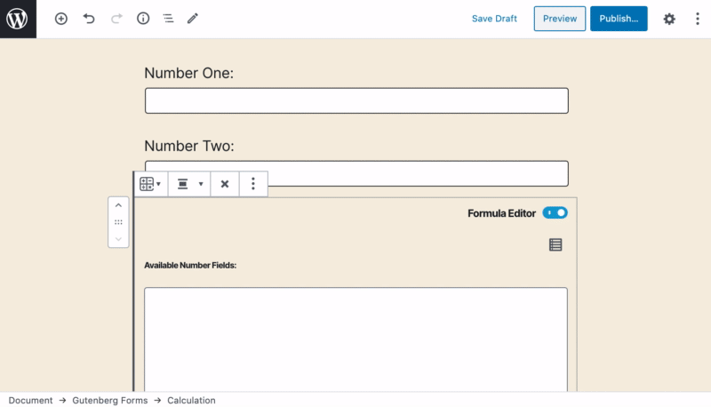
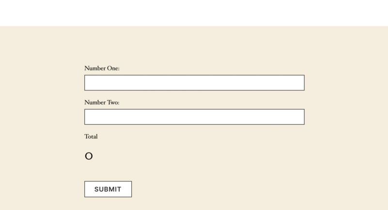

# Calculation

The **Calculation** field allows you to make a calculation as the user fills in the form. It then display the result to the user instantly and also saves it with the form submission.

### Common Settings

To learn about the common settings that are applicable to all field types kindly refer to [field settings](https://cakewp.gitbook.io/gutenberg-forms/getting-started/fields-settings#common-settings) doc

Below you will find details of additional settings that are particular to this field.

### Field Specific Settings

Besides the common settings, there are a few additional settings that are available for this field type only. These settings can be found under the "**Field Settings**" panel.

* **Prefix** - Output text before the result value. Such as currency symbol or anything.
* **Postfix** - Outputs after the result value.
* **Formulae Editor** - Toggles the formulae editor in the editor window.
* **Decimal Places** - Set a specific number of digits to the right of the decimal point to your result value.

### In-Editor Settings

The calculation field has two sides that you can toggle. 

1. **Formulae Editor** - This is visible by default, this is where you write your math formulae to any available "number" field types.
2. **Result Output** - This displays you how the output result will be displayed to the user filling the form. Switch to this while you are writing your prefix, postfix text from the sidebar settings.

The  icon shows you all the available number field types from your from that you can click and insert in the formulae editor while writing your formulae. Use any arithmetic operators between values simply.

And this is how it will work for the user.

That's just a quick example, you can write more complex formulas as well. 

