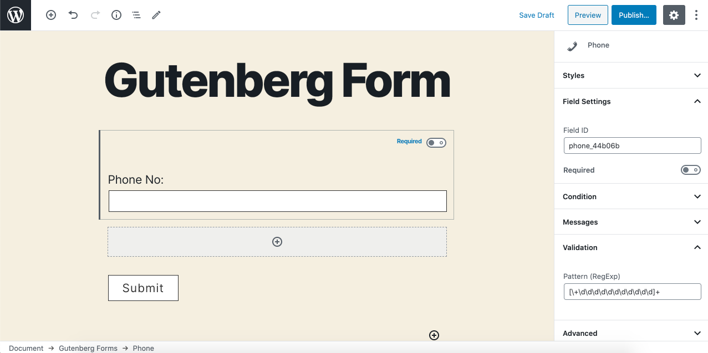
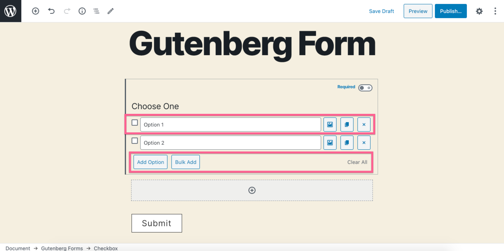
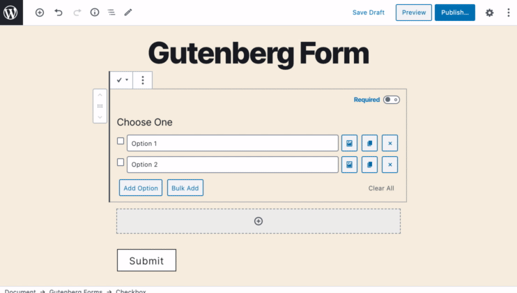
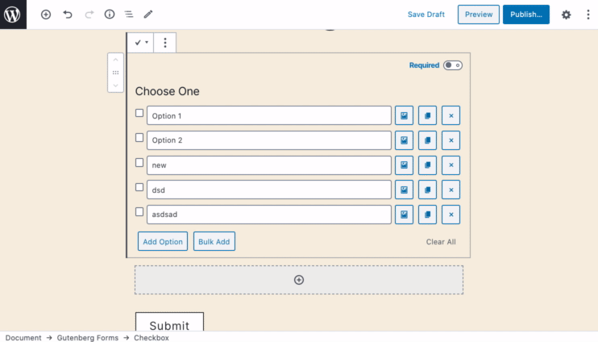
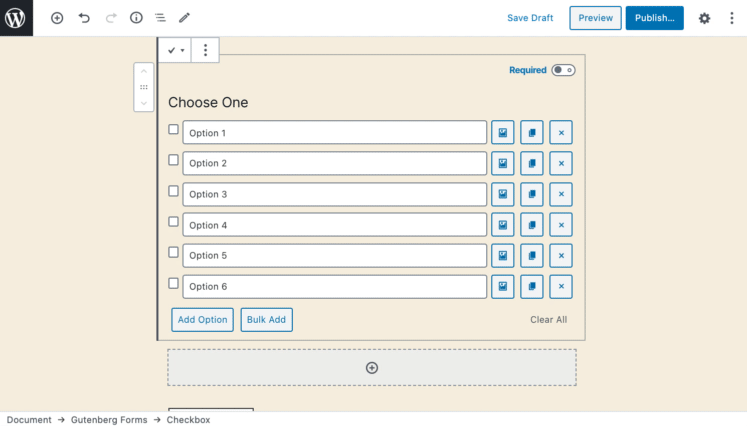
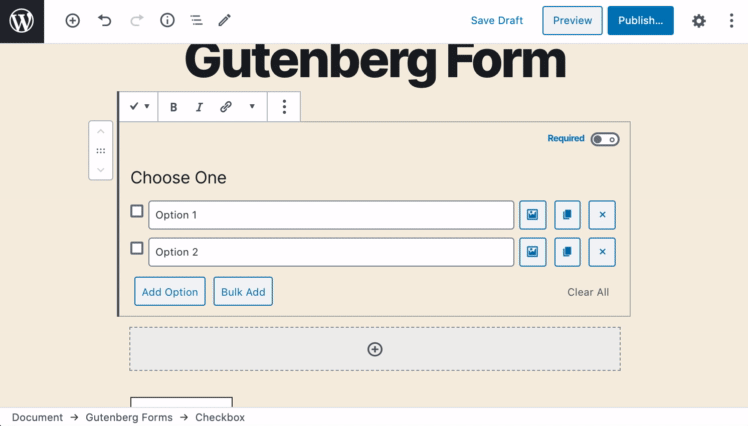
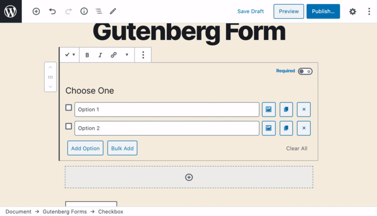
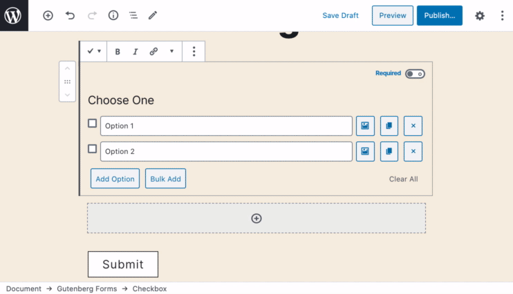

# Checkbox

The **Checkbox** field allows you to present one or many checkboxes that allow multiple selections. You may also add an image to each checkbox to display as image select options.

### Common Settings

To learn about the common settings that are applicable to all field types kindly refer to [field settings](https://cakewp.gitbook.io/gutenberg-forms/getting-started/fields-settings#common-settings) doc

Below you will find details of additional settings that are particular to this field.

### Field Specific Settings

Besides the common settings, there are a few additional settings that are available for this field type only. These settings can be found under the "**Field Settings**" panel.

* Layout - You may select how you like to display these checkboxes in your form. There are currently two layouts you can set, **Block** & **Inline**. Both are self-explanatory.

### In-Editor Settings

Besides the settings available in the sidebar control panel, there are more options available for this field type in the editor itself.

As you can there are controls on the screen to add and manage your checkbox options visually. 

**Firstly, each option has a few controls.**

* **Checkbox** - You can check this to make an option checked by default for your form. 
* **Input Field** - Here you write the option label that also acts as the value. 
*  **Image** - Click it to add an image to your checkbox. That will make it an image selection option.
*  **Duplicate** - Clicking this icon duplicates the option simply.
*  **Delete** - Click this icon to delete an option.

#### There are some options at the bottom.

* **Add Option** - Click this button to add a new option.
* **Bulk Add** - Click this button and it will open up a text box where you can simply bulk insert, edit or remove your options.
* **Clear All** - Click this button to clear all the options you have added.

#### See in action those in-editor settings.

