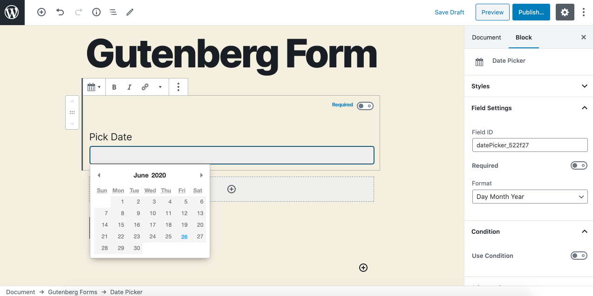

# Date

The **Date** field allows you to present a visual date picker control to users to easily select a date.

### Common Settings

To learn about the common settings that are applicable to all field types kindly refer to [field settings](https://cakewp.gitbook.io/gutenberg-forms/getting-started/fields-settings#common-settings) doc

Below you will find details of additional settings that are particular to this field.

### Field Specific Settings

Besides the common settings, there are a few additional settings that are available for this field type only. These settings can be found under the "**Field Settings**" panel.

* **Format** - You may set the desired date format here.

