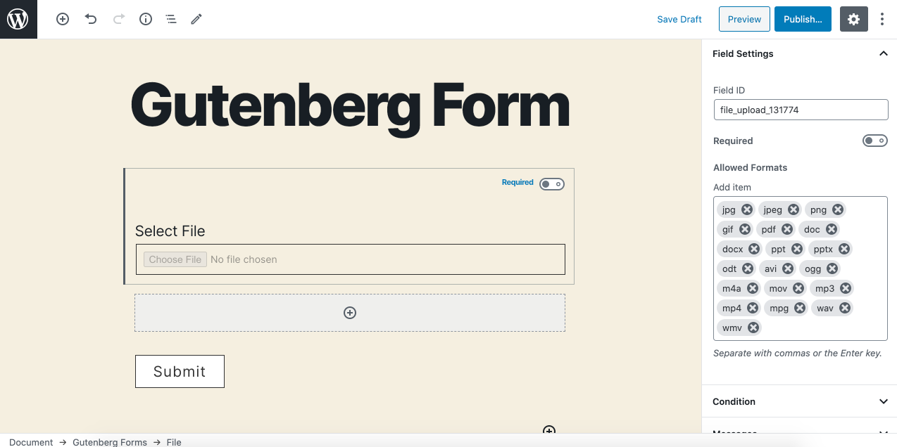

# File

The **File** field allows users to upload a file with their form submission. Additionally, you can limit which filetypes a user may upload via the formats setting. 

### Common Settings

To learn about the common settings that are applicable to all field types kindly refer to [field settings](https://cakewp.gitbook.io/gutenberg-forms/getting-started/fields-settings#common-settings) doc

Below you will find details of additional settings that are particular to this field.

### Field Specific Settings

Besides the common settings, there are a few additional settings that are available for this field type only. These settings can be found under the "**Field Settings**" panel.

* **Allowed Formats** - You can limit the format that a user can upload using this option. By default all the available formats are added, you can remove all other formats than those you like to allow. 

