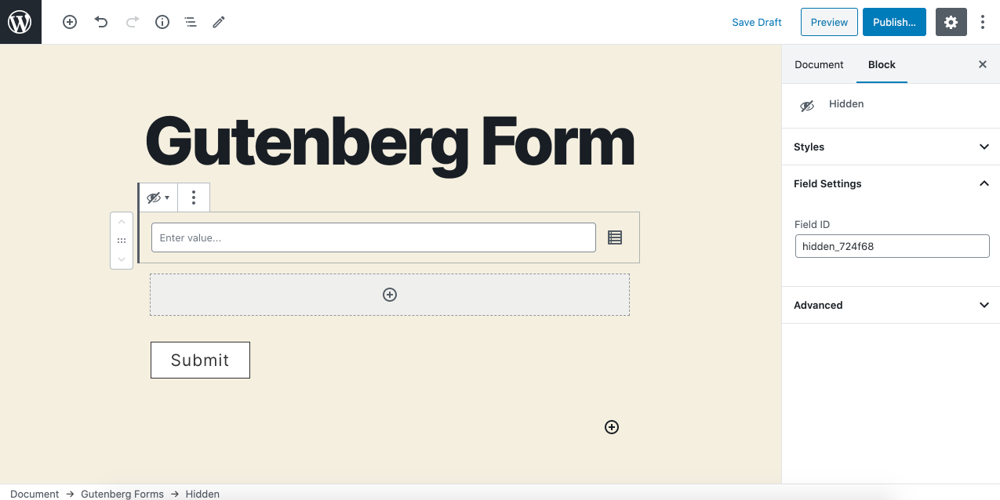
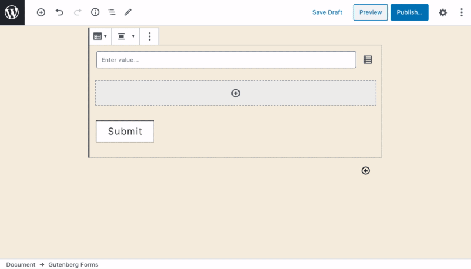

# Hidden

The **Hidden** field can be used to gather & store information that should not be visible to the user but can be processed and saved with the user submission. You can input static information or collect dynamic data via merge tags.

### Common Settings

To learn about the common settings that are applicable to all field types kindly refer to [field settings](https://cakewp.gitbook.io/gutenberg-forms/getting-started/fields-settings#common-settings) doc

Below you will find details of additional settings that are particular to this field.

### Field Specific Settings

Besides the common settings, there are currently no additional field-specific settings.

### Insert Merge Tags

Merge tags allow you to dynamically populate submitted field values and other dynamic information. You can click on the icon beside the hidden field input box that shows you a little popover with all the available merge tags and form fields.

