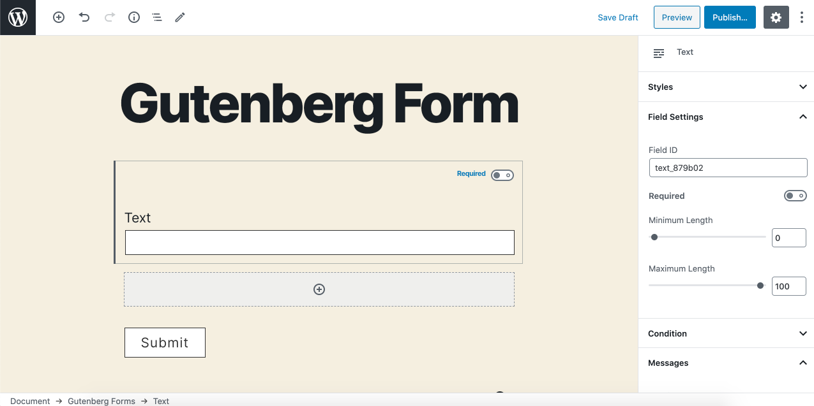
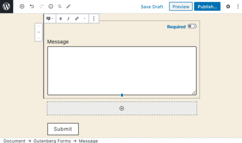

# Message

The **Message** field allows a user to enter text in a textarea form field. This can be used to request users a detailed answer to your question.

### Common Settings

To learn about the common settings that are applicable to all field types kindly refer to [field settings](https://cakewp.gitbook.io/gutenberg-forms/getting-started/fields-settings#common-settings) doc

Below you will find details of additional settings that are particular to this field.

### Field Specific Settings

Besides the common settings, there are a few additional settings that are available for this field type only. These settings can be found under the "**Field Settings**" panel.

* **Minimum Length** - You can restrict the input for a minimum number of characters using this option. 
* **Maximum Length** - Similarly you may also restrict it for maximum length in characters.

#### Drag & Adjust Height

You can easily adjust the height of this input field by dragging up & down the bottom controller pointer.

