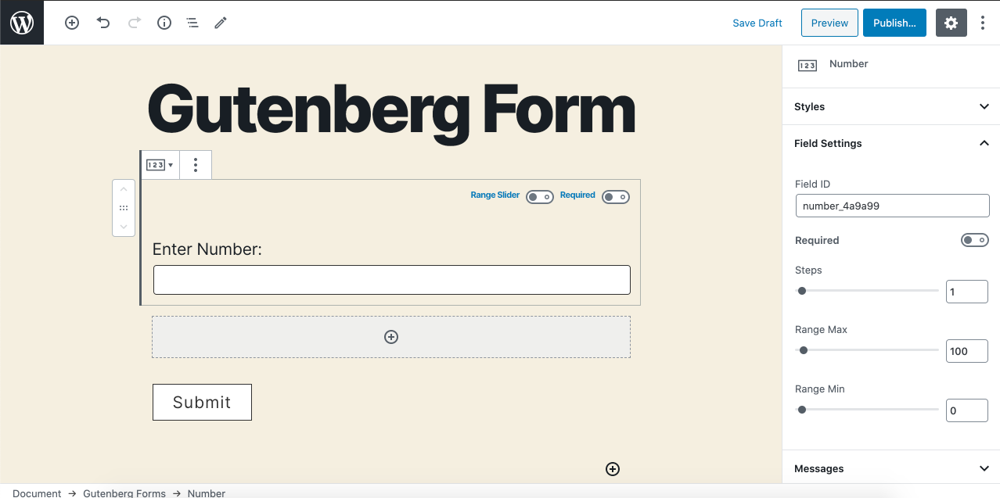
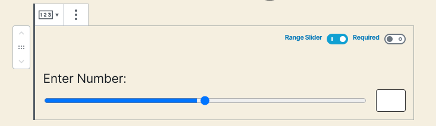

# Number

The **Number** field allows a user to enter a number. This should be used when you need the answer to be a number. You can set min and max range for number field. This is also used for calculations using the calculation block.

You can also use it as a range slider that your users can slide to adjust the value input rather than entering a numeric value in the input box.

 

### Common Settings

To learn about the common settings that are applicable to all field types kindly refer to [field settings](https://cakewp.gitbook.io/gutenberg-forms/getting-started/fields-settings#common-settings) doc

Below you will find details of additional settings that are particular to this field.

### Field Specific Settings

Besides the common settings, there are a few additional settings that are available for this field type only. These settings can be found under the "**Field Settings**" panel.

* **Steps** - This field is a stepper kind of input type, so you can adjust the step's value to be anything you like. 
* **Minimum Range** - You can restrict the input for a minimum number. 
* **Maximum Range** - Similarly you may also restrict it for the maximum number.

