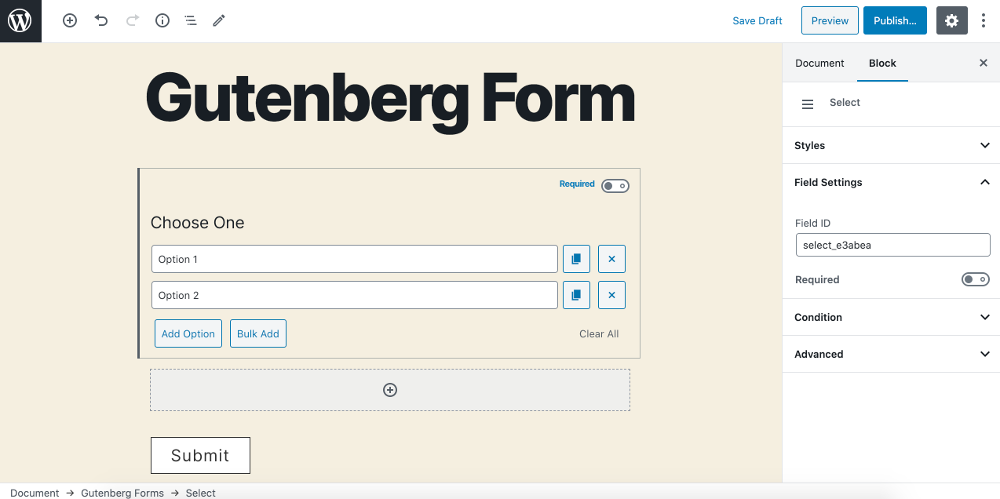
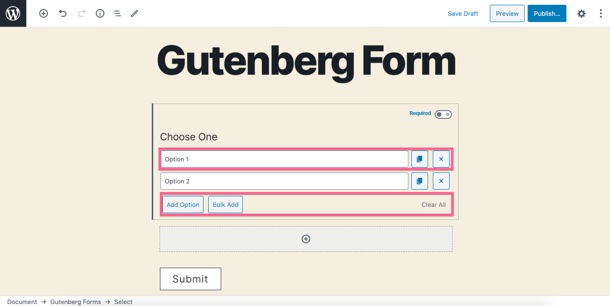
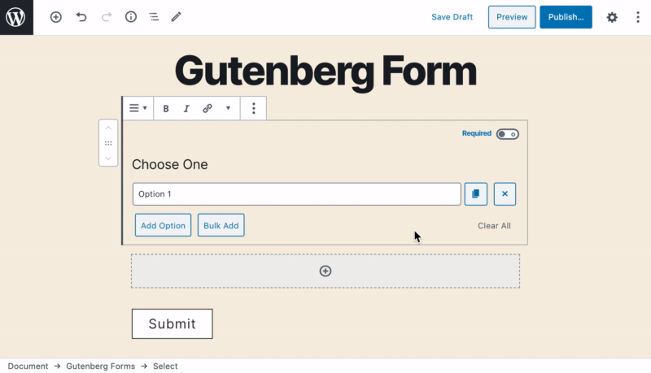
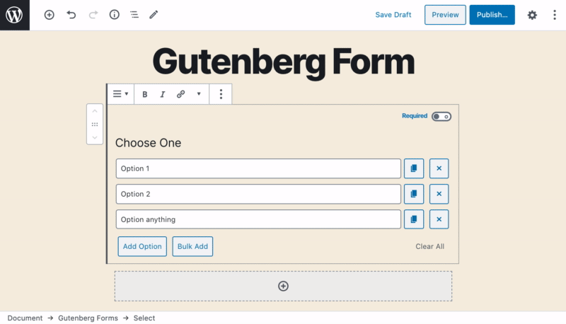
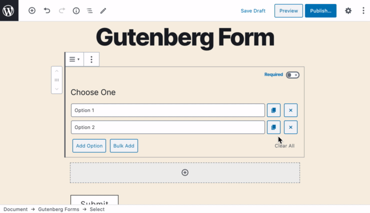
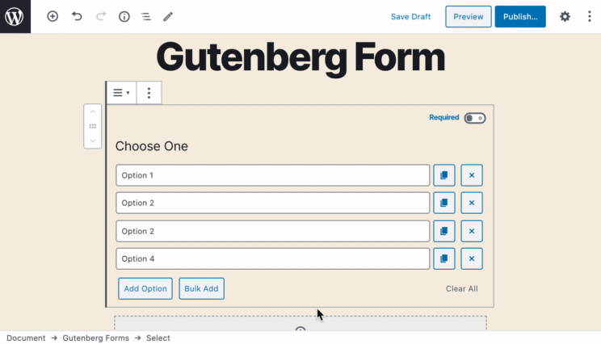
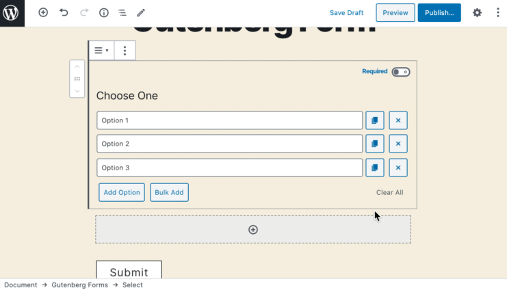

# Select

The **Select** field allows users to select one option from a list using a drop-down control. It works similar to checkbox & radio field types with an exception that you can't add an image to your options.

### Common Settings 

To learn about the common settings that are applicable to all field types kindly refer to [field settings](https://cakewp.gitbook.io/gutenberg-forms/getting-started/fields-settings#common-settings) doc‌

Below you will find details of additional settings that are particular to this field.‌

### Field Specific Settings 

Besides the common settings, there are currently no additional field-specific settings.

### In-Editor Settings 

Besides the settings available in the sidebar control panel, there are more options available for this field type in the editor itself.​‌

As you can there are controls on the screen to add and manage your drop-down options visually.‌

**Firstly, each option has a few controls.**‌

* **Input Field** - Here you write the option label that also acts as the value.
* ​​​​ **Duplicate** - Clicking this icon duplicates the option simply.
* ​​ **Delete** - Click this icon to delete an option.

#### There are some options at the bottom. 

* **Add Option** - Click this button to add a new option.
* **Bulk Add** - Click this button and it will open up a text box where you can simply bulk insert, edit or remove your options.
* **Clear All** - Click this button to clear all the options you have added.

#### See in action those in-editor settings.​​​​​​ 

