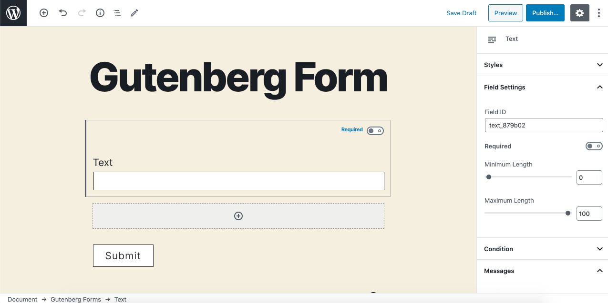

# Text

The **Text** field allows users to submit a single line of text. This field type is one of the most used input type and can be used where you need a short simple text answer for a question.

### Common Settings

To learn about the common settings that are applicable to all field types kindly check out the common settings doc.

This field uses only common field settings for the General, Appearance, and Advanced settings. For a description of each of the common field settings, [refer to this article](https://docs.gravityforms.com/common-field-settings/). 

Below you will find description of specialty settings that are particular to this field.

