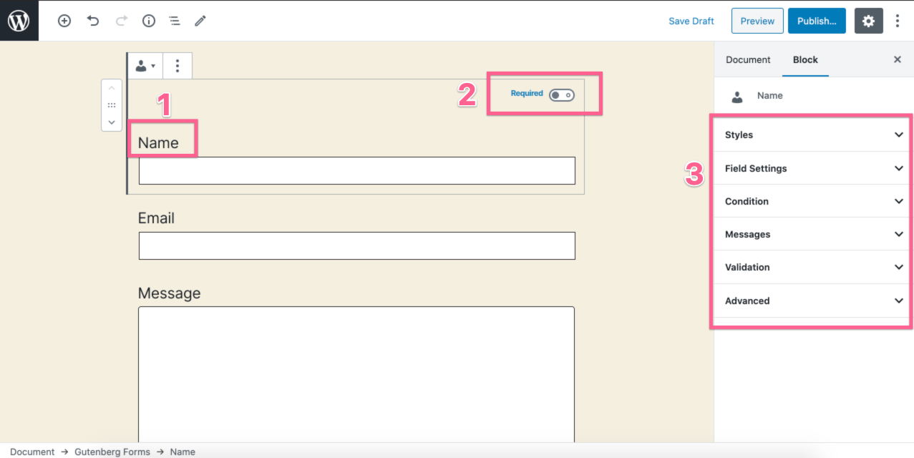
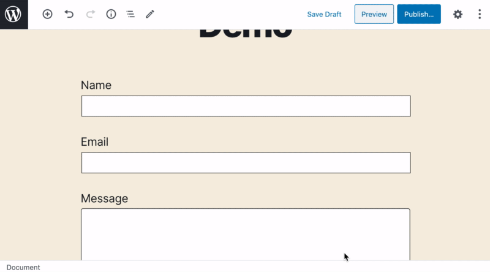
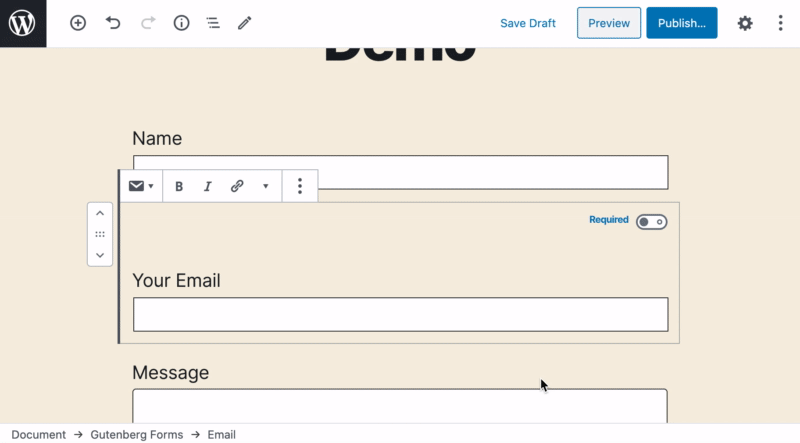
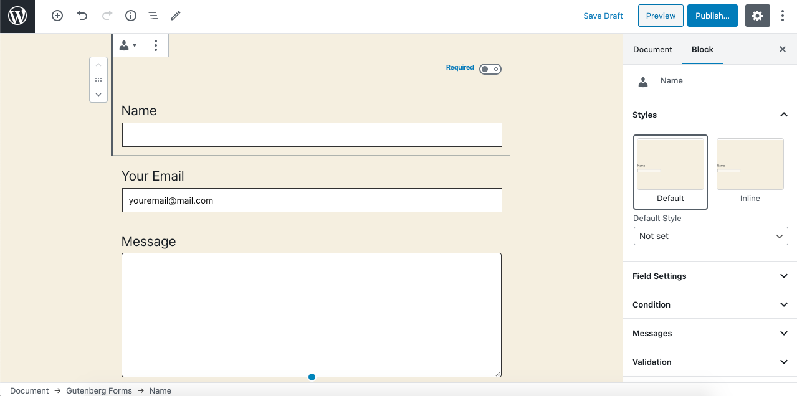
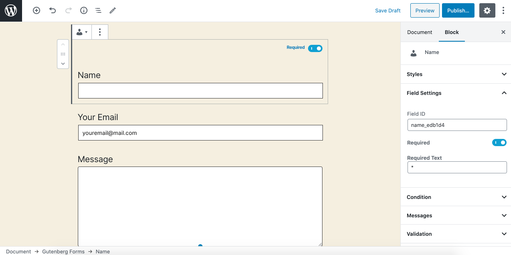
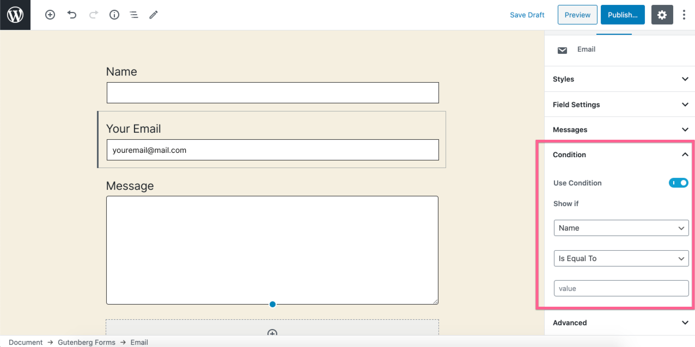
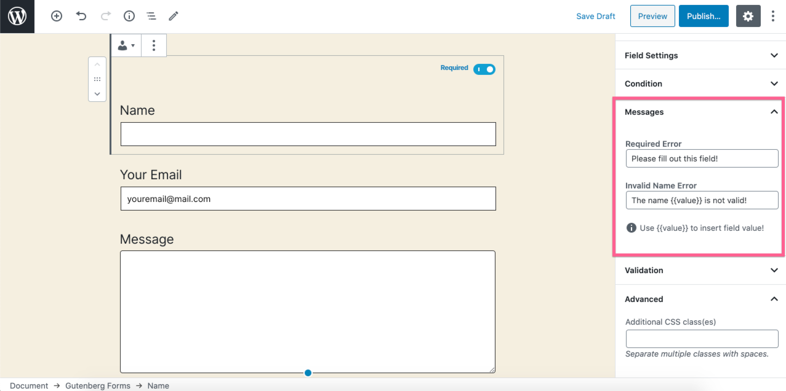

# Fields Settings

Gutenberg Forms comes with a variety of useful question/field types that lets you create any kind of form easily.

Before we jump into individual field types, let's have a look at the standard settings available for each field. 

## Standard Settings

Note that each field/question type is technically a Gutenberg block, so you may expect to use it \(add, arrange, delete\) the same way you do with any Gutenberg block.

For each field, you get some standard settings in the sidebar and some options in the editor as well.

1. **Label** - This is directly editable in the editor while you are working on a field.
2. **Required** - Simply toggle a field/question required on a click.
3. **Field Settings** - There are multiple setting panels for each field type as described below.

### How to Edit Label

Simply click and modify the filed label.

### Set Placeholder

If you want to set a placeholder text, simply write it in the input field. And it will be set as a placeholder text.

### Styles

Each field may have different styles. This works the same as standard Gutenberg block styles. Simply click on anyone and it will get applied. 


You may see more styles than the screenshot.


### Field Settings Panel

You may consider it as general settings, it currently has the following options.

* **Field ID** - This is how you recognize the field in your email notifications and elsewhere. You may modify it to something that easily recognizable to you. 
* **Required Toggle** - Enable it to make it a required field/question. You can also toggle it via the editor.
* **Required Text** - Once you enable required toggle, you may also modify the required field indicator text here.

### Condition

From here you set a field/question to conditionally show based on the value of another field/question. You simply need to select the field that you wish this field to depend on, next select a condition, and finally define your desired value. 


You can use form group block to group multiple fields/questions and apply a condition to the whole group.


### Message

For almost every field type you may see options to modify user-facing messages for:

1. **Required Error** - This message display to the user when the required field is left empty. 
2. **Validation Error** - This message display to the user when the answer has a validation error. There are some default input validations as well as you can define your custom input pattern \(check input patter instruction\).

From the messages panel, you can modify the default validation error messages for each field type. The validation error messages can be modified basically at different levels.

1. **Global** - You can simply change it once from the plugin admin area → Settings page. Those will be reflected in every form you create.
2. **Form** - You can further customize it on any specific form if you like. By default, every form picks it up from the global settings.
3. **Field** - And finally you can even modify it for any specific field in any form. By default, the field picks up the form level messages.

This way you can modify the validation error messages from global to the field level. 

### Input Pattern

While we have a variety of input types for you that does are enough for most cases. But, you can also restrict user inputs using custom patterns. You can also call it an input mask, this allows you to set rules for the value a user is allowed to enter into a field. This can be useful for international phone numbers, zip codes, and more.

This requires you to understand [RegExp](https://developer.mozilla.org/en-US/docs/Web/JavaScript/Reference/Global_Objects/RegExp). You might start [here](https://html.com/attributes/input-pattern/) to learn about input patterns and how you can create one.


This setting may not be available for all field types. 


### Advanced

This is a default settings panel you would see on every Gutenberg block. You may simply assign a CSS class from there to any field. 

