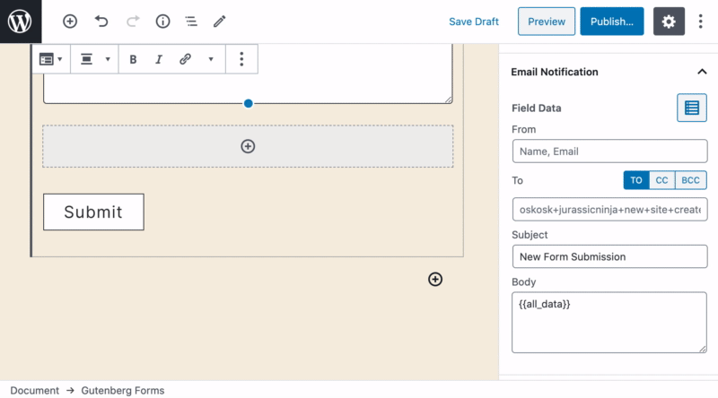

# Form Settings

## Gutenberg Form Settings

Gutenberg Forms Block has different settings that you can customize for each form you create.

Let's have a look at the different form settings.

### Styles

Gutenberg forms come with different pre-made styles that you can apply to your form. Simply click on a style to apply it.


Theme authors/developers may also quickly register a new style for using the [Gutenberg Styles API](https://developer.wordpress.org/block-editor/developers/filters/block-filters/#block-style-variations).


### Form Design

Here you can adjust the basic form color scheme. 

### General

In the General settings panel you may configure the following options:

* **Form Label** - This is used as the form id and helps you recognize the entries from the entries screen. make sure you change it to something easily recognizable with the form you are creating.
* **Disable Submit Button** - You can disable the default submit button that is placed at the bottom of the form. You can use the "Form Button" block to place a submit button wherever you like inside the form. 
* **Button Alignment** - This is to adjust the alignment of the default submit button.
* **Confirmation Type** - Configure what would you like to happen on successful form submission. You can either display a thank you message or redirect to a URL. 
* **Hide Form On Submission** - If you are showing a success message, you can also hide the form on submission and only show the success message.

### Email Notification

Here you can configure the email notification settings easily. It has the following options.

* **From** - You can specify the from name & email \(separated by a comma\) here. By default it picks up your admin user as the sender.
* **To** - The email address where you like to send out the form data.
* **CC** - Email address where you like to send out a copy.
* **BCC** - Another email address where you like to send out another copy.

* **Subject** - Write your email subject here.
* **Body** - Here you can define what data you like to receive in the email. By default, it has `{{all_data}}` tag that retrieves all the fields of your form. But, you can remove that and define your own structure by defining only the data you need. 

📝 _You can also insert some dynamic data besides form filed values._ 

### Form Action

Here you can pick available form actions. A Form action is simply an action that triggers on successful form submission. 

By default, there are currently two actions available.

1. **Record Entries** - Allows you to save the form submission into your website database that you can access via the "Entries" screen.
2. **Email Notification** - This action sends out the form data via the email to the sender\(s\) you configured via the Email Notification settings.

Both actions are enabled by default. If you like to disable anyone simply remove it from the action. So this way you can disable email notification or entries recording for any particular form you create. 


There may be more actions available via add-ons or in future updates.


### Messages

From the messages panel, you can modify the default validation error messages for each field type. These validation messages can be modified basically at different levels.

1. **Global** - You can simply change it once from the plugin admin area → Settings page. Those will be reflected in every form you create.
2. **Form** - You can further customize it on any specific form if you like. By default, every form picks it up from the global settings.
3. **Field** - And finally you can even modify it for any specific field in any form. By default, the field picks up the form level messages.

This way you can modify the validation error messages from global to the field level. 

### Advanced

This is a default settings panel you would see on every Gutenberg block. You may simply assign a CSS class from there to your forms. This way you can further customize your forms using CSS.

