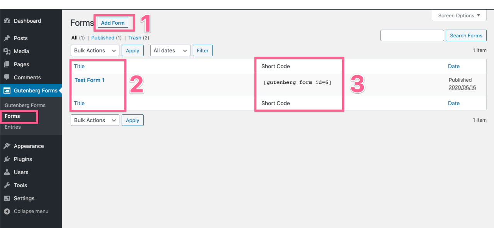

# Two Ways to Create Form

There are two ways you can create forms using Gutenberg Forms. 

### Method One

The first method is via the “**Forms**” screen in the admin. It is a custom post type that lets you create standalone forms and inject it on any page or post. You can even inject it outside the Gutenberg editor using a shortcode.

Head over to your WordPress dashboard and go to the **Gutenberg Forms** → **Forms** page.

This is where you create and manage your forms. Let's first understand what is there for you.

1. You can create new forms using the "Add New" button on the top.
2. You will see the list of forms you have already created and can edit or delete them.
3. For each form you create, there will be a shortcode generated for you. You can copy and paste this shortcode anywhere to display your form.

### Method Two

The second method is creating a form directly from the post or page editor. For one-off forms, this may be the method to use. 

You can simply create Forms in Gutenberg editor while you are writing your content on a page or post. No way to head over to another screen to create a form and then insert it into a page or post.


The Steps to create a form are the same using both ways. That you can learn on the next pages.


