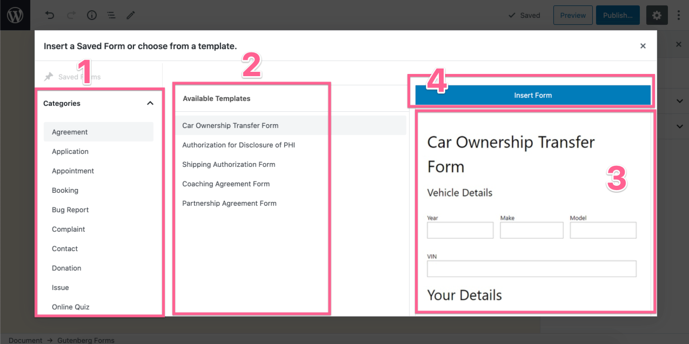

# Form Templates Library

At Gutenberg Forms, we are committed to create a growing library of ready to use form templates for different niches and use cases. You can easily find a useful template to jump-start your form creation and save time.

Click on the "Insert Form" button when you start creating a new form. This shows you a popup screen and from there you can browse and choose a template to use. 

This is the popup that lets you choose a form template from the library.

1. **Categories** - We have classified the templates into categories for better organization. 
2. **Available Templates** - Each category contains a number of form templates.
3. **Preview** - Once you select a template, you can see a preview screenshot of that form template. 
4. **Insert Form** - Once you made a choice, simply click on the "Insert Form Button" to insert that form template.

That's it. A fully editable form will be inserted and you can further customize it as per your need.

