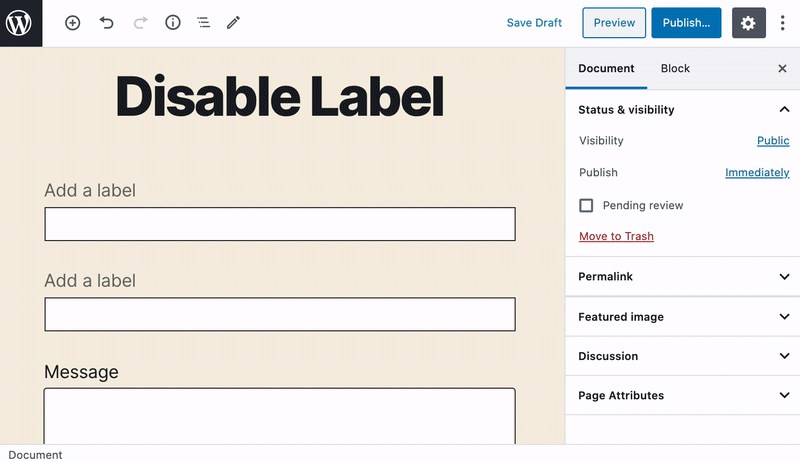
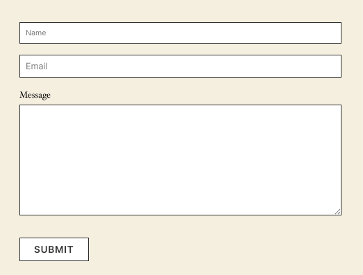

# How to add a placeholder text to an input field?

Adding a placeholder value is very easy in Gutenberg Forms. Simply write it inside the input field, and that will be applied as a placeholder on the front-end.

Here is how it looks on the front-end.

No labels and with a placeholder value for the first two fields. That's easy. 😇

