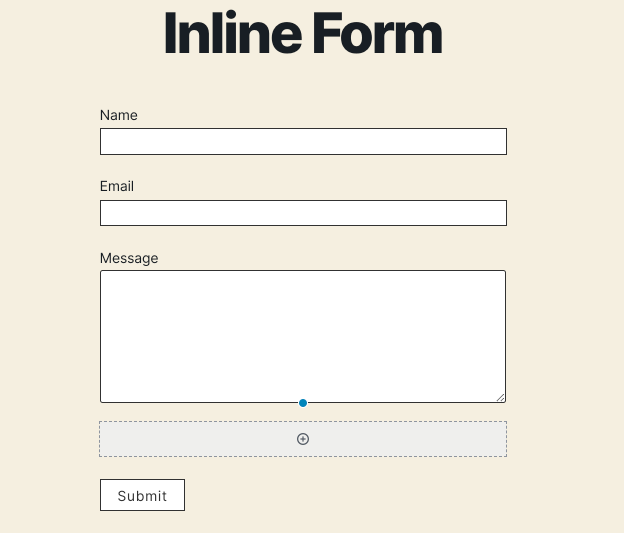
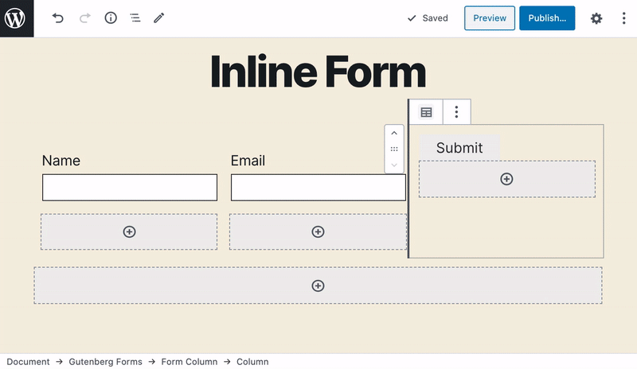

# How to create inline forms in Gutenberg

Creating any form layout with Gutenberg form is super easy. It comes with a "**Form Columns**" block which you can use to create any layout. Let's see how easy it is to create an inline form using it. 

**Here is a step-by-step tutorial.**

If you are creating the form directly on a page, post or CPT add the Gutenberg Forms block. And if you are creating it via the "**Forms**" screen, ignore this step. 

Now click on the standard button that will insert a basic standard form. You can then remove extra fields and add need fields/blocks.

For this tutorial we will create a form with the following fields:

* Name
* Email
* Button

So we can simply remove the Message field from the standard form. We also need to disable the default submit button as we need to place it inside a column. 

Simply select the main form block and from the sidebar settings, you can disable it under the "General" settings panel.

Now let's add a **form columns** block and add 3 columns. 

Now drag the name and email fields in each column.

Finally, add a "**Form Button**" block in the last column. 

That's it! we have created an inline form with 3 columns. You can add more columns if you wish. And style the button or fields using the customization options available in the sidebar.

This is how it looks on the front-end for the **Tweenty TweentyTheme**. Your output may be different depending on the theme you are using.  

The button sticks on the top of the column as other content. You may either use custom CSS to align it to the bottom vertically. Or simply use a spacer block above it to add spacing from the top.

This is how it looks on the front with the spacer added and some colors applied to the button.

You may also be interested in removing the label and adding it as a placeholder. Check out these two posts for that.





Hope that was helpful. 😇

